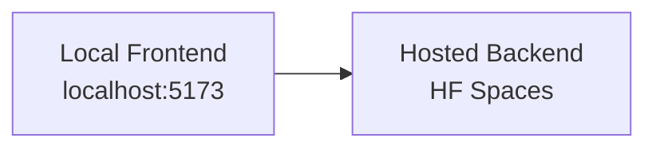

# Handly Local Setup Guide

This document explains how to run the application locally on a professor's machine. The project is split into two separate repositories:

- Frontend: React + Vite
- Backend: Express + MongoDB + Socket.io

For professor testing, the backend is already hosted temporarily on HF Spaces and can be used directly from a local frontend. You do not need to host the backend yourself for the test period.

## 1) What You Need

Before starting, install the following:

- Node.js 20 LTS recommended
- npm (comes with Node.js)
- Git
- A MongoDB Atlas account or another reachable MongoDB instance
- Cloudinary credentials
- Resend API key
- Email account credentials for Nodemailer
- Hugging Face API key

## 2) Clone the Repositories

Replace the placeholders below with your real GitHub repository URLs.

```bash
git clone https://github.com/yojimbo-ah/tailwind-learning
git clone https://github.com/yojimbo-ah/Sewinger-backend
```

If you prefer a different folder structure, keep both repos in separate folders so they can be started independently.

## 3) Recommended Folder Layout

```text
workspace/
├─ tailwind-learning/
└─ sewinger-backend/
```

## 4) Backend Setup

This section is only needed if you want to run the backend locally. For professor testing, you can skip it and use the hosted backend instead.

Go to the backend folder first:

```bash
cd sewinger-backend
npm install
```

Create a `.env` file in the backend root with the required values:

```env
MONGO_NAME=your_mongodb_username
MONGO_PASSWORD=your_mongodb_password
BCRYPT_CODE=your_jwt_secret
EMAIL=your_email_address
EMAIL_PASSWORD=your_email_app_password
CLOUDINARY_NAME=your_cloudinary_name
CLOUDINARY_API_KEY=your_cloudinary_api_key
CLOUDINARY_API_SECRET=your_cloudinary_api_secret
RESEND_API_KEY=your_resend_api_key
HF_KEY=your_huggingface_api_key
FRONTEND_URL=http://localhost:5173
PORT=3000
```

### Backend Start Command

```bash
npm run dev
```

If you want the production-style start command instead:

```bash
npm start
```

## 5) Frontend Setup

Open a second terminal and go to the frontend folder:

```bash
cd tailwind-learning
npm install
```

Create a `.env` file in the frontend root:

```env
VITE_REACT_APP_URL=https://yojimbo-ah-handly.hf.space
```

This points the local frontend to the hosted backend directly. The frontend can run on `localhost` while the API requests go to HF Spaces.

### Frontend Start Command

```bash
npm run dev
```

The frontend usually runs on:

```bash
http://localhost:5173
```

## 6) How The Two Servers Work Together



For professor testing, the setup is intentionally simple:

1. Install the frontend dependencies in `tailwind-learning`.
2. Make sure the frontend `.env` file points `VITE_REACT_APP_URL` to `https://yojimbo-ah-handly.hf.space`.
3. Start the frontend with `npm run dev`.
4. Open the app in the browser at `http://localhost:5173`.

In this mode, the frontend runs on the professor's machine, but all API calls go to the hosted backend on HF Spaces. That means the professor does not need to clone or start the backend locally unless they specifically want to inspect backend code or run development tests.

Use these addresses as the reference point:

- Local frontend: `http://localhost:5173`
- Hosted backend: `https://yojimbo-ah-handly.hf.space`

The flow is:

- Browser opens the local Vite app.
- React renders the UI from the professor's machine.
- Requests for login, data loading, chat, notifications, and other features are sent to the hosted backend.
- The backend responds over the network, so the local app behaves like a normal connected deployment without any additional hosting work.

If something does not load, the first thing to check is that the frontend `.env` file still uses the hosted backend URL and not `http://localhost:3000`.

## 7) Quick Commands

```bash
# Backend
cd sewinger-backend
npm install
npm run dev

# Frontend
cd tailwind-learning
npm install
npm run dev
```

## 8) Optional: Docker & Kubernetes

If you prefer containerized runs, there is a Docker setup in the project and it is possible to run the services inside containers or orchestrate them with Kubernetes. However, because Handly only has two main servers (frontend and backend) running them in two separate terminals is simpler and recommended for professor testing.

- Docker: a Dockerfile (and optional docker-compose setup) exists — use it if you already use containers. Commands will vary depending on the compose file and environment.
- Kubernetes: supported in principle but not required; we do not recommend introducing k8s for this short, local test flow.

If you want help running the project with Docker or creating a simple `docker-compose.yml` for both services, I can add that next.

## 8) Available Scripts

### Frontend

```bash
npm run dev      # Start Vite dev server
npm run build    # Build production assets
npm run lint     # Run ESLint
npm run preview  # Preview the production build
```

### Backend

```bash
npm run dev         # Start backend with nodemon
npm start           # Start backend with node
npm test            # Run test suite
npm run test:watch  # Run tests in watch mode
npm run test:coverage # Run tests with coverage
```

## 9) Important Environment Notes

- The backend will stop at startup if required environment variables are missing.
- `FRONTEND_URL` is used for socket origin checks and email links.
- `VITE_REACT_APP_URL` is used by the frontend to call the backend API.
- The backend listens on port `3000` by default, but it respects `PORT` if you set it.
- `FRONTEND_URL` should match the local frontend address (`http://localhost:5173`) because that is the only allowed origin for professor testing.

## 10) Testing And Verification

For professor testing, you only need to install and run the frontend locally:

```bash
cd tailwind-learning
npm install
npm run dev
```

If you want to test the backend locally for development, you can still run it separately using the backend setup section above.

If you want to test the backend only, run:

```bash
cd sewinger-backend
npm test
```

Useful backend test commands:

```bash
npm test
npm run test:watch
npm run test:coverage
```

Useful frontend verification commands:

```bash
npm run lint
npm run build
```

## 11) Troubleshooting & Debugging (step-by-step)

If you run into errors, follow these ordered checks to collect information and resolve common problems. Run each step and note results when asking for help.

1) Verify local environment

```bash
# Node and npm
node -v
npm -v

# Ensure dependencies are installed in each repo
cd tailwind-learning && npm install
cd ../sewinger-backend && npm install
```

2) Confirm frontend configuration

- Open `tailwind-learning/.env` and ensure `VITE_REACT_APP_URL` is set to the hosted backend when using the HF Spaces test instance:

```env
VITE_REACT_APP_URL=https://yojimbo-ah-handly.hf.space
```

- Remove surrounding quotes if present (the env parser used by Vite may treat them as part of the value).

3) Start the frontend and observe logs

```bash
cd tailwind-learning
npm run dev
```

- Watch the terminal output for build errors.
- Open the browser to `http://localhost:5173` and open Developer Tools (Console + Network).

4) Check API calls and CORS errors in the browser

- In the Network tab, inspect any failing requests. A 4xx/5xx HTTP response or a blocked request will show the response headers.
- If the browser console shows CORS errors, check that the backend is allowing `http://localhost:5173` as an origin.

5) If something fails server-side (only if running backend locally)

```bash
cd sewinger-backend
npm run dev
```

- Check server console logs for errors during startup (missing env vars cause exit).
- If MongoDB connection errors appear, verify `MONGO_NAME` and `MONGO_PASSWORD`, and make sure your IP is allowed in the Atlas cluster security settings.

6) Socket / real-time issues

- Open the browser console and look for Socket.io connection logs or errors.
- Confirm the frontend is using the hosted backend URL and that `FRONTEND_URL` on the backend side is `http://localhost:5173` (the hosted backend must whitelist that origin).

7) Useful commands for diagnostics

```bash
# Show listening processes (Windows PowerShell)
Get-NetTCPConnection -LocalPort 5173 -ErrorAction SilentlyContinue

# Test HTTP reachability to the hosted backend
curl -I https://yojimbo-ah-handly.hf.space

# Tail backend logs (if running locally and logs to stdout)
# (Use the terminal where you started `npm run dev`)
```

8) What to collect before asking for help

- Browser console output (copy/paste errors)
- Network tab request/response for failing API calls (save HAR if possible)
- Terminal output from `npm run dev` for frontend and backend
- Contents of `tailwind-learning/.env` (only non-secret keys) and backend `.env` keys list (do NOT share secrets)

Armed with the above, share the logs and I can help diagnose the problem faster.
https://yojimbo-ah-handly.hf.space

## 12) More Details

If you want to understand why this setup works, especially why the local frontend can connect directly to the hosted HF Spaces backend, check the core setup and the documentation folder for the full explanation. You can also return to the documentation if you need more details about any other part of the project setup.

## 13) Notes For The Professor

This is the initial version of the setup guide. It is intentionally written as a clean base document so you can request edits later, such as:

- replacing placeholders with the final GitHub repository links
- including deployment instructions
- shortening or expanding the environment variable section
- adding a one-page quick start version
